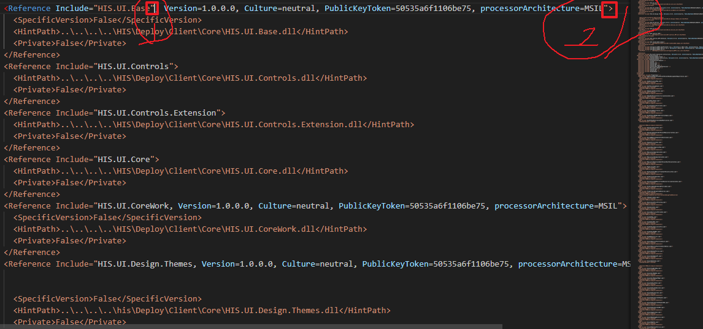
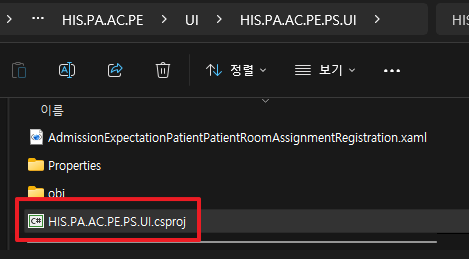

# 해결방법

```
D:\HISSolutions\HIS.PA\HIS.PA.AC.PE\UI\HIS.PA.AC.PE.PS.UI
```


인수가 준 csproj와 비교해 보다 vscode에 올려보니 문제를 찾았다.
```
HIS.PA.AC.PE.PS.UI.csproj
```




## 페이지 비교방법

notepad++ 프로그램에서 상단에 플러그인 -> 플러그인 추가 -> compare 설치 -> compare -> compare


##
ps와 cf는 csproj를 잡지 못한다.
csproj는 다른 파일이 참조할 수 있게 해주는 역할이다.

