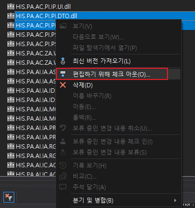
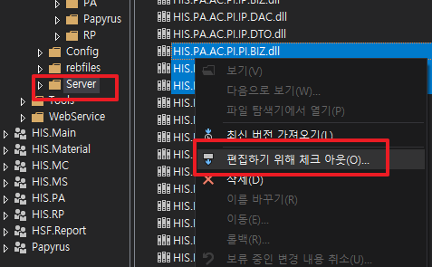
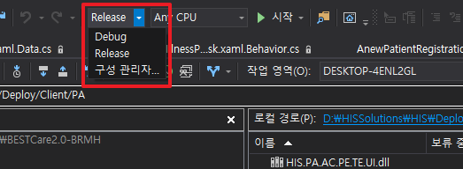
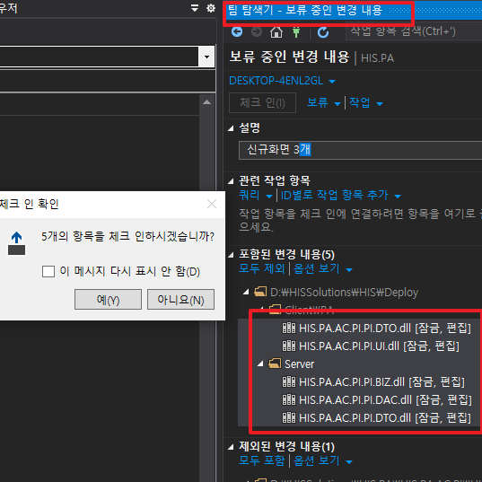
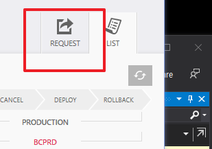
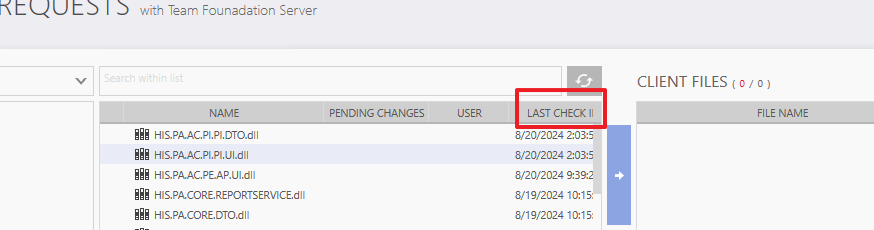
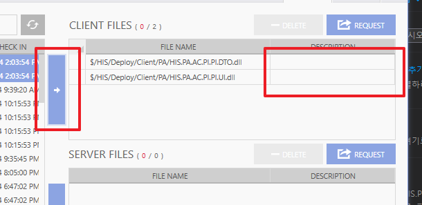
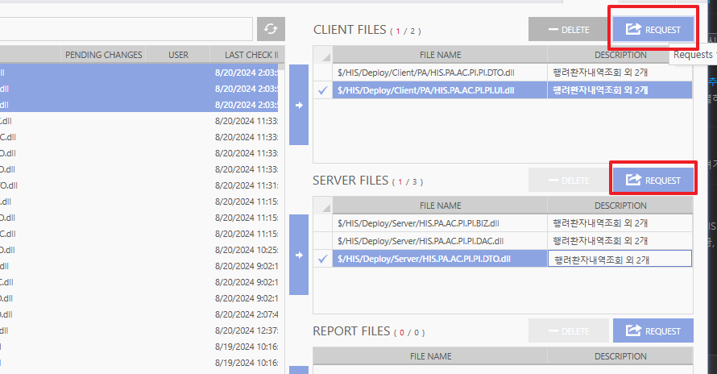

# 배포
## 배포하는 법
아래 내용을 기억해라.
- Client
    - UI
    - DTO

- Server
    - BIZ
    - DAC
    - DTO
    
### Visual Studio
```
소스제어 탐색기 -> HIS/Deploy dll 최신버전 가져오기 -> 수정한 파일 체크아웃 ->  Visual studio 화면 상단에 Debug를 Release로 변경 -> 수정한 프로젝트 다시 빌드 
```

1. Sever와 Client 두 디렉토리에 들어가서 3개, 2개를 체크아웃 해줘야 한다.

     

2. Realese로 변경 후, 다시 빌드를 진행한다. 이후에 팀 탐색기에서 수정한 파일을 보면, 평소 체크인 하듯이 해줘야 한다.

     

3. 이 때, 설명란에 배포 내용을 "<strong style="color:green">상세하게 작성</strong>"해야 한다.

    


### Deploy
```
Deploy 실행 -> Deploy에 체크한 Dll 파일이 나온다. 

-> UI & DTO를 수정했기 때문에 Client 추가 
-> DTO & DAC & BIZ 를 수정했다면 SERVER에 추가

-> 이후 DESCRIPTION을 작성 후, 요청 -> 자주 들어가서 각 단계 확인 -> 배포 끝
```
4. Deploy 프로그램을 실행하면, 우측 상단에 Request를 선택한다.
    
    

5. 내가 수정/체크인한 디렉토리를 찾아 LAST CHACK를 누르면 최신 정보가 나온다.

    

6. 수정한 파일들을 찾아 각 공간에 넣어주고, DESCRIPTION을 체크인 설명란과 유사하게 작성해준다.
    
    
7. 이후 각각 REQUEST로 요청하면 끝
    


## 배포 이후
- 배포가 있다면, Deploy는 매일 아침마다 승인이 되었는지 수시로 확인하는 것이 좋다.
- 개발기는 매 시간 정각에 올라가며, REQUEST 마다 요청 버튼이 생기는데 눌러주면 된다.

    

