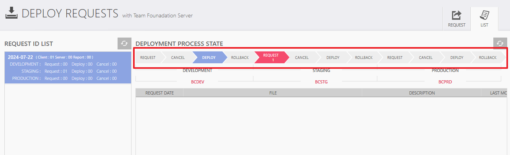

# 배포
## 배포하는 법
- Client
    - UI
    - DTO

- Server
    - BIZ
    - DAC
    - DTO
    
### Visual Studio
```
소스제어 탐색기 -> 수정한 파일 체크아웃 -> 최신버전 가져오기 -> Visual studio 화면 상단에 Debug를 Release로 변경 -> 다시 빌드 
```

### Deploy
```
Deploy 실행 -> Deploy에 체크한 Dll 파일이 뜬다. -> UI를 수정했기 때문에 Client 추가 
```
Deploy는 매일 아침마다 승인이 되었는지 수시로 확인하는 것이 좋다.
